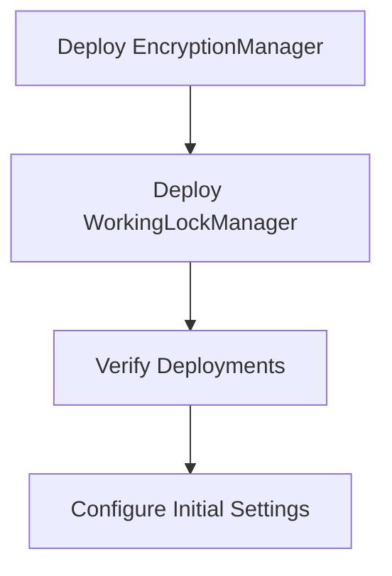

# Deployment Guide

This guide provides comprehensive instructions for deploying and integrating the Secure Smart Contracts Library.

## 📋 Table of Contents

- [Pre-Deployment Checklist](#pre-deployment-checklist)
- [Network Requirements](#network-requirements)
- [Deployment Order](#deployment-order)
- [Configuration Steps](#configuration-steps)
- [Integration Examples](#integration-examples)
- [Verification & Testing](#verification--testing)
- [Post-Deployment Security](#post-deployment-security)
- [Troubleshooting](#troubleshooting)

## ✅ Pre-Deployment Checklist

### Environment Setup

- [ ] **Solidity Compiler**: Version 0.8.30 installed and configured
- [ ] **Development Framework**: Hardhat, Foundry, or Truffle set up
- [ ] **Network Configuration**: RPC endpoints and private keys configured
- [ ] **Gas Settings**: Appropriate gas price and limit settings
- [ ] **Wallet Security**: Hardware wallet or secure key management

### Security Preparations

- [ ] **Code Review**: All contracts thoroughly reviewed
- [ ] **Testing**: Comprehensive test suite passes on testnets
- [ ] **Static Analysis**: Slither, MythX, or similar tools run
- [ ] **Key Management**: Secure storage for deployment keys
- [ ] **Backup Plans**: Emergency response procedures documented

### Documentation

- [ ] **Deployment Parameters**: All constructor arguments prepared
- [ ] **Owner Addresses**: Final owner contracts ready
- [ ] **Backup Wallets**: Emergency backup addresses identified
- [ ] **PIN Selection**: Secure 6-digit PINs chosen

## 🌐 Network Requirements

### Supported Networks

| Network | Solidity Version | Gas Limit | Notes |
|---------|------------------|-----------|-------|
| Ethereum Mainnet | 0.8.30 | 30M | Full functionality |
| Polygon | 0.8.30 | 30M | Lower gas costs |
| BSC | 0.8.30 | 140M | High gas limit |
| Arbitrum | 0.8.30 | 32M | L2 scaling |
| Optimism | 0.8.30 | 15M | L2 scaling |

### Gas Requirements

| Contract | Deployment Gas | Constructor Args |
|----------|----------------|------------------|
| EncryptionA | N/A | Library |
| EncryptionManager | ~1,200,000 | None |
| WorkingLockManager | ~1,800,000 | encryptionManager |
| LockableContract | ~800,000 | lockManager, encryptionManager |
| ReflectionLibrary | N/A | Library |

### Recommended Gas Settings

```javascript
// Mainnet
gasPrice: "20000000000", // 20 gwei
gasLimit: "3000000"      // 3M gas

// Testnets  
gasPrice: "1000000000",  // 1 gwei
gasLimit: "5000000"      // 5M gas
```

## 🏗️ Deployment Order

### Phase 1: Core Infrastructure



#### 1. Deploy EncryptionManager

```solidity
// Hardhat deployment script
const EncryptionManager = await ethers.getContractFactory("EncryptionManager");
const encryptionManager = await EncryptionManager.deploy();
await encryptionManager.deployed();

console.log("EncryptionManager deployed to:", encryptionManager.address);
```

```bash
# Foundry deployment
forge create src/EncryptionManager.sol:EncryptionManager \
  --rpc-url $RPC_URL \
  --private-key $PRIVATE_KEY \
  --gas-limit 1500000
```

#### 2. Deploy WorkingLockManager

```solidity
// Hardhat
const WorkingLockManager = await ethers.getContractFactory("WorkingLockManager");
const lockManager = await WorkingLockManager.deploy(encryptionManager.address);
await lockManager.deployed();

console.log("WorkingLockManager deployed to:", lockManager.address);
```

```bash
# Foundry
forge create src/WorkingLockManager.sol:WorkingLockManager \
  --rpc-url $RPC_URL \
  --private-key $PRIVATE_KEY \
  --constructor-args $ENCRYPTION_MANAGER_ADDRESS \
  --gas-limit 2000000
```

### Phase 2: Application Contracts

#### 3. Deploy Your Application Contract

```solidity
// Example: Secure Token with reflection
const SecureToken = await ethers.getContractFactory("SecureToken");
const token = await SecureToken.deploy(
    lockManager.address,           // WorkingLockManager
    encryptionManager.address,     // EncryptionManager
    "Secure Token",                // Name
    "SECURE",                      // Symbol
    ethers.utils.parseEther("1000000")  // Initial supply
);
await token.deployed();
```

### Phase 3: Verification

```bash
# Verify contracts on block explorer
npx hardhat verify --network mainnet CONTRACT_ADDRESS

# Or with Foundry
forge verify-contract CONTRACT_ADDRESS src/EncryptionManager.sol:EncryptionManager \
  --chain-id 1 \
  --etherscan-api-key $ETHERSCAN_API_KEY
```

## ⚙️ Configuration Steps

### Step 1: Set Final Owners

```solidity
// Configure EncryptionManager
const finalOwnerContract = "0x..."; // Must be a contract
const pin = 123456;                 // 6-digit PIN

await encryptionManager.setOwner(finalOwnerContract, pin);
console.log("Final owner set for EncryptionManager");

// Configure WorkingLockManager  
await lockManager.setOwner(finalOwnerContract, pin);
console.log("Final owner set for WorkingLockManager");
```

### Step 2: Setup Backup Wallets (Within 12 Hours)

```solidity
// Must be done within 12 hours of deployment
const backupWallet = "0x...";

// From final owner contract
await encryptionManager.connect(finalOwnerSigner).setBackupWallet(backupWallet);
await lockManager.connect(finalOwnerSigner).setBackupWallet(backupWallet);

console.log("Backup wallets configured");
```

### Step 3: Initialize Application Features

```solidity
// Example: Initialize reflection fees
await token.initializeReflection(
    200,  // 2% creator fee
    300,  // 3% reflection fee  
    100,  // 1% liquidity fee
    100,  // 1% burn fee
    creatorAddress,
    liquidityPoolAddress
);
```

## 🔗 Integration Examples

### Basic Token Integration

```solidity
// SPDX-License-Identifier: MIT
pragma solidity ^0.8.30;

import "./LockableContract.sol";
import "./ReflectionLibrary.sol";

contract SecureReflectionToken is LockableContract {
    using ReflectionRewards for ReflectionRewards._AccountData;
    using ReflectionRewards for ReflectionRewards._FeeConfig;
    using ReflectionRewards for ReflectionRewards._ReflectionState;
    
    string public name;
    string public symbol;
    uint8 public decimals = 18;
    uint256 public totalSupply;
    
    ReflectionRewards._FeeConfig private feeConfig;
    ReflectionRewards._ReflectionState private reflectionState;
    mapping(address => ReflectionRewards._AccountData) private accounts;
    
    constructor(
        address _workingLockManager,
        address _encryptionManager,
        string memory _name,
        string memory _symbol,
        uint256 _totalSupply
    ) LockableContract(_workingLockManager, _encryptionManager) {
        name = _name;
        symbol = _symbol;
        totalSupply = _totalSupply;
        
        // Initialize deployer balance
        accounts[msg.sender].reflectedBalance = _totalSupply;
        reflectionState.totalExcludedSupply = _totalSupply;
    }
    
    function transfer(address to, uint256 amount) 
        external 
        notLocked 
        returns (bool) 
    {
        return _transfer(msg.sender, to, amount);
    }
    
    function transferFrom(address from, address to, uint256 amount)
        external
        notLocked
        returns (bool)
    {
        // Allowance logic here
        return _transfer(from, to, amount);
    }
    
    function _transfer(address from, address to, uint256 amount) 
        internal 
        returns (bool) 
    {
        require(from != address(0) && to != address(0), "Invalid address");
        require(balanceOf(from) >= amount, "Insufficient balance");
        
        // Process transaction with fees and reflection
        (uint256 netAmount, uint256 totalFees) = feeConfig.processTransaction(
            reflectionState,
            accounts,
            from,
            to,
            amount
        );
        
        // Update balances
        accounts[from].updateBalance(accounts[from].getBalance() - amount);
        accounts[to].updateBalance(accounts[to].getBalance() + netAmount);
        
        emit Transfer(from, to, netAmount);
        return true;
    }
    
    function balanceOf(address account) public view returns (uint256) {
        return accounts[account].getBalance();
    }
    
    // Administrative functions with lock protection
    function initializeReflection(
        uint256 creatorFeeBps,
        uint256 reflectionFeeBps,
        uint256 liquidityFeeBps,
        uint256 burnFeeBps,
        address creatorAddress,
        address liquidityPool
    ) external allowInternal {
        require(msg.sender == address(this) || msg.sender == owner, "Unauthorized");
        
        feeConfig.initializeFees(
            creatorFeeBps,
            reflectionFeeBps,
            liquidityFeeBps,
            burnFeeBps,
            creatorAddress,
            liquidityPool
        );
    }
}
```

### DeFi Protocol Integration

```solidity
contract SecureDeFiProtocol is LockableContract {
    struct Pool {
        uint256 totalLiquidity;
        mapping(address => uint256) userBalances;
        bool isActive;
    }
    
    mapping(bytes32 => Pool) public pools;
    
    constructor(
        address _workingLockManager,
        address _encryptionManager
    ) LockableContract(_workingLockManager, _encryptionManager) {}
    
    function addLiquidity(bytes32 poolId, uint256 amount) 
        external 
        notLocked 
    {
        require(pools[poolId].isActive, "Pool not active");
        // Liquidity logic with lock protection
    }
    
    function removeLiquidity(bytes32 poolId, uint256 amount)
        external
        notLocked
    {
        // Removal logic with lock protection
    }
    
    // Emergency functions that work when interface is locked
    function emergencyWithdraw(bytes32 poolId)
        external
        allowInternal
    {
        // Emergency withdrawal logic
        // Can be called internally even when interface is locked
    }
}
```

## 🧪 Verification & Testing

### Deployment Verification Script

```javascript
// verify-deployment.js
async function verifyDeployment() {
    const encryptionManager = await ethers.getContractAt("EncryptionManager", ENCRYPTION_MANAGER_ADDRESS);
    const lockManager = await ethers.getContractAt("WorkingLockManager", LOCK_MANAGER_ADDRESS);
    
    // Verify deployment timestamps
    const encryptionDeployTime = await encryptionManager.deploymentTimestamp();
    const lockDeployTime = await lockManager.deploymentTimestamp();
    
    console.log("Encryption Manager deployed at:", new Date(encryptionDeployTime * 1000));
    console.log("Lock Manager deployed at:", new Date(lockDeployTime * 1000));
    
    // Verify owner settings
    const encryptionOwner = await encryptionManager.owner();
    const lockOwner = await lockManager.owner();
    
    console.log("Encryption Manager owner:", encryptionOwner);
    console.log("Lock Manager owner:", lockOwner);
    
    // Test basic functionality
    const isLocked = await encryptionManager.isContractLocked(TEST_CONTRACT_ADDRESS);
    console.log("Test contract locked:", isLocked);
    
    return {
        encryptionManager: ENCRYPTION_MANAGER_ADDRESS,
        lockManager: LOCK_MANAGER_ADDRESS,
        verified: true
    };
}
```

### Integration Testing

```javascript
// integration-test.js
describe("Integration Tests", function() {
    let encryptionManager, lockManager, token;
    
    beforeEach(async function() {
        // Deploy contracts
        encryptionManager = await EncryptionManager.deploy();
        lockManager = await WorkingLockManager.deploy(encryptionManager.address);
        token = await SecureToken.deploy(lockManager.address, encryptionManager.address);
    });
    
    it("Should prevent transfers when locked", async function() {
        // Lock the token contract
        await lockManager.lockInterface(
            token.address,
            dataId,
            data,
            pubKeyX,
            pubKeyY,
            ephemeralKey
        );
        
        // Attempt transfer (should fail)
        await expect(
            token.transfer(user.address, ethers.utils.parseEther("100"))
        ).to.be.revertedWith("Contract interface is locked");
    });
    
    it("Should allow unlocking with correct PIN", async function() {
        // Lock and then unlock
        await lockManager.lockInterface(token.address, dataId, data, pubKeyX, pubKeyY, ephemeralKey);
        await lockManager.unlockInterface(token.address, dataId, recipientPrivKey, correctPIN);
        
        // Transfer should now work
        await expect(
            token.transfer(user.address, ethers.utils.parseEther("100"))
        ).to.not.be.reverted;
    });
});
```

## 🔐 Post-Deployment Security

### Security Checklist

- [ ] **Owner Transition**: Final owners set and deployer access removed
- [ ] **Backup Wallets**: Emergency access configured within time window
- [ ] **PIN Security**: PINs stored securely and not reused
- [ ] **Contract Verification**: Source code verified on block explorers
- [ ] **Access Controls**: All functions properly protected
- [ ] **Time Windows**: Deployment timing documented

### Monitoring Setup

```javascript
// monitoring.js - Event monitoring
const encryptionManager = new ethers.Contract(address, abi, provider);

// Monitor critical events
encryptionManager.on("ContractLocked", (targetContract, dataId, event) => {
    console.log(`Contract ${targetContract} locked with data ID ${dataId}`);
    // Alert system integration
});

encryptionManager.on("ContractUnlocked", (targetContract, dataId, event) => {
    console.log(`Contract ${targetContract} unlocked`);
    // Update monitoring dashboard
});

// Monitor for unexpected owner changes
encryptionManager.on("OwnerSet", (newOwner, event) => {
    console.log(`New owner set: ${newOwner}`);
    // Security alert if unexpected
});
```

### Emergency Procedures

#### If Backup Wallet Needed

```solidity
// From backup wallet
await encryptionManager.connect(backupWallet).unlockContract(
    targetContract,
    dataId,
    recipientPrivKey,
    emergencyPIN
);
```

#### If PIN Forgotten

1. **If within 24-hour window**: Use backup wallet with original PIN
2. **If past 24 hours**: Data is permanently encrypted (by design)
3. **Prevention**: Always backup PINs securely

#### If Owner Contract Compromised

1. **Interface Lock**: Use WorkingLockManager to lock interface functions
2. **Full Lockdown**: Use EncryptionManager for complete contract freeze
3. **Emergency Withdrawal**: Use `allowInternal` functions if available

## 🔧 Troubleshooting

### Common Deployment Issues

#### 1. Gas Estimation Failures

```javascript
// Solution: Manual gas limit
const tx = await contract.deploy({
    gasLimit: 3000000,
    gasPrice: ethers.utils.parseUnits("20", "gwei")
});
```

#### 2. Constructor Argument Errors

```javascript
// Verify argument types and addresses
const args = [
    lockManagerAddress,     // address
    encryptionManagerAddress, // address
    "Token Name",           // string
    "SYMBOL",              // string
    ethers.utils.parseEther("1000000") // uint256
];
```

#### 3. Time Window Expiry

```javascript
// Check remaining time
const deployTime = await contract.deploymentTimestamp();
const currentTime = Math.floor(Date.now() / 1000);
const timeRemaining = (deployTime + 12 * 3600) - currentTime;

console.log(`Time remaining for backup setup: ${timeRemaining} seconds`);
```

### Runtime Issues

#### 1. Lock Status Debugging

```javascript
async function debugLockStatus(contractAddress) {
    const interfaceLocked = await lockManager.isInterfaceLocked(contractAddress);
    const contractLocked = await encryptionManager.isContractLocked(contractAddress);
    
    console.log({
        contract: contractAddress,
        interfaceLocked,
        contractLocked,
        canExecute: !interfaceLocked && !contractLocked
    });
}
```

#### 2. PIN Verification Issues

```javascript
// Verify PIN hash matches
const pin = 123456;
const storedHash = await contract.pinHash();
const computedHash = ethers.utils.keccak256(ethers.utils.defaultAbiCoder.encode(["uint256"], [pin]));

console.log("Hash matches:", storedHash === computedHash);
```

#### 3. Time Window Validation

```javascript
async function checkTimeWindow(ciphertext) {
    const currentTime = Math.floor(Date.now() / 1000);
    const encryptionTime = ciphertext.timestamp;
    const windowExpiry = encryptionTime + (24 * 3600);
    
    console.log({
        currentTime,
        encryptionTime,
        windowExpiry,
        isValid: currentTime <= windowExpiry,
        timeRemaining: Math.max(0, windowExpiry - currentTime)
    });
}
```

### Recovery Procedures

#### Lost PIN Recovery (Within 24 hours)

1. Backup wallet must exist and be accessible
2. Original PIN must be used (backup wallet doesn't change PIN)
3. Must be within decryption window

#### Contract Lock Recovery

1. **Interface Lock**: Can be unlocked by authorized users
2. **Full Lock**: Requires decryption with correct PIN
3. **Emergency**: Use backup wallet within time windows

---

For additional support and advanced deployment scenarios, see the [Contributing Guidelines](CONTRIBUTING.md) or open an issue on GitHub.